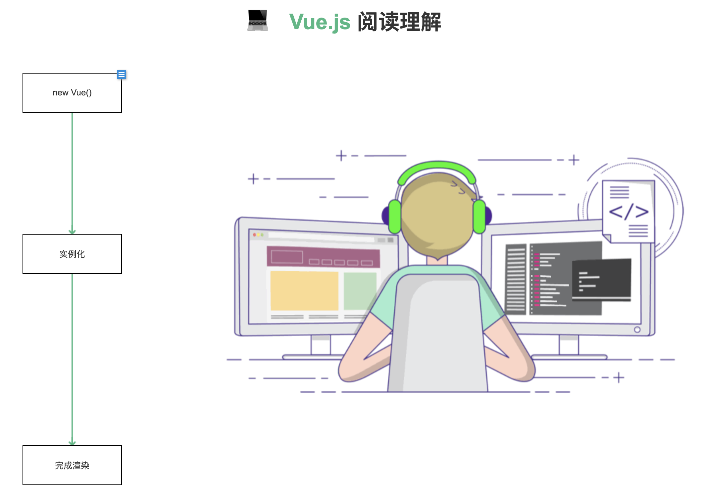

<html>
<div align = "center">
  <h1>💻 <font color="#42B983">Vue.js</font> 阅读理解</h1>
  
</div>
</html>

### 这个工程的目的？

vue.js工程的源码阅读过程是非常枯燥的，而且在阅读一些关键逻辑的时候，需要再脑海中绘制抽象流程图。因为绘制简易的流程图达不到我理想的效果，所以想到使用Axure这款软件，来绘制可以交互流程图。这样带有交互的阅读更生动且清晰，且能详细记录自己的阅读过程。

### 如何开始？
点击<font color="#42B983">new Vue()</font>开始阅读。

大概是下面这样的呈现(如果样式错乱,清除缓存刷新,后期结构会随时调整)




```
【提示1】一些步骤可以点击交互。
【提示2】需要配合vue源码工程阅读。
【提示3】下载本项目，导入Axure并随意修改,或许你有更好的理解。
```

### 目前进度？
初步计划在4月中旬之前完成。
- [x] Vue的大致渲染流程。
- [ ] Vue的组件化过程。
- [ ] Vue的响应式原理。
- [ ] Vue的工具类函数。
- [ ] 读后的一些思考。

### 关于Axure
Axure RP是一款专业的快速原型设计工具。
为了更好的理解Vue的功能运行机制，我选择Axure RP这款原型绘制工具来帮助我绘制流程图。

可能我用的功能并不多，感觉使用的过程非常简单，推荐尝试一下。

#### 为何选择Axure？

1.为了熟练使用一种原型设计软件。

2.普通绘制流程图的一些软件，难以达到很好的交互效果。

3.提供类似于一种组件化的组合方案，方便整理与归类，过程也更直观。

4.它可以直接将绘制完成的RP工程发布成HTML文件。

```
ps: 图片资源来自网络,联系删除.
    如果样式错乱,清除缓存刷新.
```